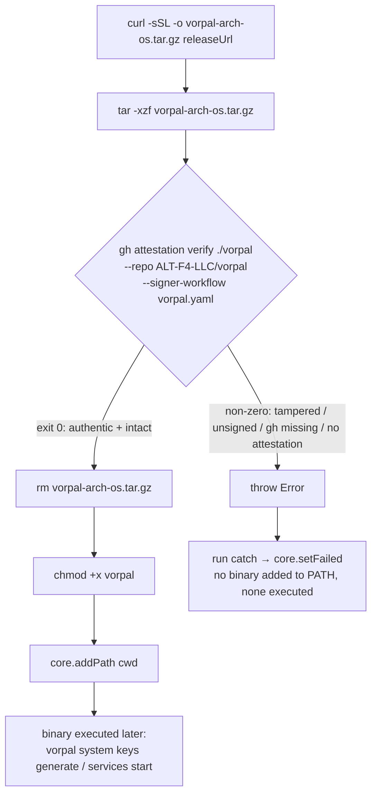

## Problem Statement

**What.** `installVorpal()` (`src/index.ts`, the `else` branch, lines 208-228)
downloads a Vorpal release tarball over the network, extracts it, marks the inner
`vorpal` binary executable, and adds it to `PATH` — all with **zero integrity or
authenticity verification**. The binary is subsequently executed
(`generateVorpalKeys()` → `vorpal system keys generate`; `startVorpal()` →
`vorpal system services start`) with the full privileges of the CI job.

**Why now.** This is a pre-existing supply-chain gap flagged High severity during a
prior design consult on the sibling DKT-1 epic (auto-latest lookup, which selects the
tarball version dynamically). DKT-6 is standalone and closes the gap independently of
DKT-1. An attacker who can tamper with the artifact in transit (network position on
the GitHub release CDN path) or at rest (a compromised release asset) achieves
**arbitrary code execution on the runner**, with access to job secrets, the
`GITHUB_TOKEN`, and — under the S3 registry backend — `AWS_ACCESS_KEY_ID` /
`AWS_SECRET_ACCESS_KEY` (`src/index.ts` lines 297-315).

**Who is affected.** Every consumer of `setup-vorpal-action` that installs a released
binary (i.e., `use-local-build: false`, the default download path).

**Constraints.**

- The action runs inside a GitHub Actions runner (Node 20+ action runtime).
- It already shells out to external tools via `@actions/exec` (`curl`, `tar`,
  `chmod`, `sudo`, `apt`) — new verification should match that convention, not
  introduce a foreign paradigm.
- Verification MUST occur **before** `chmod +x` and before any execution of the
  binary.
- Out of scope: DKT-1 (auto-latest lookup — do not touch, do not block); the
  `use-local-build: true` branch (`src/index.ts` lines 202-207 — no network
  download, not in DKT-6's acceptance criteria).

**Acceptance criteria (verbatim from DKT-6).**

1. Investigate what integrity verification mechanisms `ALT-F4-LLC/vorpal`'s release
   process publishes (checksums file, GPG/sigstore signatures, GitHub attestations,
   SLSA provenance, etc.).
2. Based on findings, implement verification of the downloaded tarball before
   `chmod +x` in `installVorpal()`.
3. On verification failure, `installVorpal()` throws (caught by the existing
   top-level try/catch → `core.setFailed` in `run()`) — no silent continuation with
   an unverified binary.

**Business context.** A CI action that installs and executes an unverified binary is
a textbook software-supply-chain exposure (SLSA threat "compromised package
registry / build artifact"). Closing it materially raises the cost of a runner-level
compromise for downstream consumers at effectively zero ergonomic cost when the
runner is GitHub-hosted.

## Context & Prior Art

**Investigation findings (AC #1) — verified this session against the real
`ALT-F4-LLC/vorpal` repository, 2026-07-12.** Each claim below is labelled
`VERIFIED` (I ran the command and observed the result) or `INFERRED` (reasoned, not
directly observed) per Epistemic Discipline.

- **VERIFIED — No checksum/signature files are published as release assets.** The
  latest release `0.4.0` publishes exactly four assets and nothing else:
  `vorpal-aarch64-darwin.tar.gz`, `vorpal-aarch64-linux.tar.gz`,
  `vorpal-x86_64-darwin.tar.gz`, `vorpal-x86_64-linux.tar.gz`. There is **no**
  `SHA256SUMS`/`.sha256` file, no `.sig`/`.asc`/`.pem`, and no standalone
  `*.intoto.jsonl` / SLSA provenance file alongside the assets.
  (`gh release view 0.4.0 --repo ALT-F4-LLC/vorpal --json assets`.)
- **VERIFIED — The repo DOES emit GitHub artifact attestations (SLSA build
  provenance, keyless sigstore/Fulcio).** The release workflow
  (`.github/workflows/vorpal.yaml`, `release` job) runs
  `actions/attest-build-provenance@v4` with `permissions: attestations: write` +
  `id-token: write`. This attestation is stored in GitHub's attestation API (and the
  sigstore transparency log), **not** as a release asset — which is why the asset
  listing above shows none.
- **VERIFIED — The attestation subject is the EXTRACTED inner binary, NOT the
  `.tar.gz`.** The workflow extracts each tarball, renames the inner `vorpal` to
  `vorpal-<arch>-<os>`, and attests those extracted files
  (`subject-path: dist/<arch>-<os>/vorpal-<arch>-<os>`). Consequently
  `gh attestation verify vorpal-x86_64-linux.tar.gz --repo ALT-F4-LLC/vorpal`
  returns **HTTP 404** (no attestation matches the tarball's digest), while
  verifying the _extracted_ binary succeeds. This is the single most important
  design constraint: **we must extract first, then verify the extracted binary.**
- **VERIFIED — `gh attestation verify` matches on the file's SHA256 digest and is
  filename-independent.** Verifying the extracted file both under its original name
  `vorpal` and renamed `vorpal-x86_64-linux` succeeds identically (exit 0). No local
  rename is required for the digest lookup to match.
- **VERIFIED — The signing identity is the tagged release workflow.** The Fulcio
  signing certificate's SAN is
  `https://github.com/ALT-F4-LLC/vorpal/.github/workflows/vorpal.yaml@refs/tags/<version>`,
  OIDC issuer `https://token.actions.githubusercontent.com`, source repo
  `ALT-F4-LLC/vorpal`, trigger `push` on `refs/tags/<version>`. This is the trust
  anchor available for identity pinning.
- **VERIFIED — Tamper detection works (negative control).** Flipping a single byte in
  the extracted binary causes `gh attestation verify` to exit non-zero (exit 1).
- **VERIFIED — Attestation coverage extends to recent tags.** `0.2.2`, `0.3.0`, and
  `0.4.0` all have valid attestations for their extracted `x86_64-linux` binary.
  **INFERRED** — versions older than `0.2.2` may predate attestation adoption and
  therefore have no attestation; this is the residual documented in Risks.

**Prior art in this repo.** `src/index.ts` already uses `@actions/exec`
(`exec.exec`) for every external tool (`curl`, `tar`, `rm`, `chmod`, `sudo`, `apt`,
and `vorpal` itself). `getLatestVersion()` (lines 20-59) already reads
`process.env.GITHUB_TOKEN` and sends it as a `Bearer` credential to the GitHub API,
establishing the precedent that a GitHub token is available and consumed by this
action. There is no `docs/` tree yet — this is the first TDD.

**Prior art outside this repo.** GitHub artifact attestations + `gh attestation
verify` are GitHub's first-party supply-chain verification path (SLSA build
provenance v1, sigstore keyless signing via Fulcio, transparency via Rekor). The
`gh` CLI is pre-installed on all GitHub-hosted runners.

## Alternatives Considered

### Alternative A — GitHub artifact attestation verification via `gh attestation verify` (CHOSEN)

**Shape.** After extracting the tarball, run
`gh attestation verify <extracted-binary> --repo ALT-F4-LLC/vorpal
--signer-workflow ALT-F4-LLC/vorpal/.github/workflows/vorpal.yaml` via `exec.exec`.
Non-zero exit ⇒ throw ⇒ fail-closed. Verify the exact file that is subsequently
`chmod +x`'d and executed.

**Strengths.**

- **Authenticity, not just integrity.** Cryptographically proves the binary was
  produced by `ALT-F4-LLC/vorpal`'s tagged release workflow. This _solves the
  bootstrapping problem_ that a checksum-alongside-artifact cannot (see Alternative
  B): the trust anchor is GitHub's OIDC + sigstore public-good infrastructure, not a
  value fetched over the same untrusted channel as the artifact.
- **Zero key-management burden** on this action — keyless signing; no public key to
  embed, rotate, or pin manually. Identity pinning is declarative (`--repo` +
  `--signer-workflow`).
- **Matches existing conventions** — one more `exec.exec` call alongside
  `curl`/`tar`/`chmod`; `gh` is pre-installed on GitHub-hosted runners.
- **Already exists upstream** — no ask of the Vorpal maintainers; attestations are
  live today for `0.2.2`+.

**Weaknesses.**

- Hard runtime dependency on the `gh` CLI. Pre-installed on GitHub-hosted runners
  but not guaranteed on self-hosted runners → must fail-closed with a clear,
  actionable error (not silently skip).
- Online verification — requires network egress to GitHub's attestation API and
  sigstore trust-root (TUF) endpoints. Acceptable in CI; noted as an availability
  dependency.
- No coverage for pre-`0.2.2` versions (residual, documented).

### Alternative B — Self-computed checksum pinning (per-release SHA256 embedded in this repo)

**Shape.** Maintain a table of known-good SHA256 digests per `{version, arch, os}`
inside `setup-vorpal-action`. After download, compute the digest and compare against
the pinned value; mismatch ⇒ throw.

**Strengths.** No external-tool dependency (Node's `crypto` suffices); works offline
after download; deterministic.

**Weaknesses.**

- **Does not scale to dynamic versions.** DKT-1 (auto-latest) selects the version at
  runtime; a hard-coded digest table cannot cover a version that did not exist when
  this action was released. This is a structural conflict with the sibling epic.
- **Only transport integrity if digests are fetched remotely; authenticity requires
  a trusted, out-of-band source.** Embedding digests in-repo _is_ an out-of-band
  channel (git history + release review), so this is a legitimate fallback — but it
  shifts a recurring maintenance burden onto this repo (every Vorpal release needs a
  digest PR here) and creates a stale-pin failure mode.
- **Verdict:** viable _only as a fallback_ if upstream published nothing. Since
  upstream publishes attestations, Alternative A strictly dominates. Retained in this
  document as the documented fallback should attestations ever regress.

### Alternative C — Verify by fetching a checksums file from the same release

**Shape.** Download a `SHA256SUMS` asset from the release, then verify the tarball
against it.

**Strengths.** Simple, conventional where such a file exists.

**Weaknesses.**

- **Not applicable — upstream publishes no such file** (VERIFIED above).
- **Even if it did, it provides only transport integrity, not authenticity.** A
  checksums file fetched over the same channel as the artifact is compromised by the
  same adversary who can swap the artifact (the bootstrapping problem). Without a
  detached signature over the checksums file (which upstream also does not publish),
  this adds little over TLS. **Verdict: rejected.**

## Architecture & System Design

The change is localized to the `else` branch of `installVorpal()`
(`src/index.ts` lines 208-228). The current flow is:

```
curl -sSL -o <asset> <releaseUrl>   →   tar -xzf <asset>   →   rm <asset>
   →   chmod +x vorpal   →   core.addPath(cwd)
```

The target flow inserts a fail-closed verification gate on the **extracted binary**,
before `chmod +x`:



**Key design points.**

- **Verify the extracted binary, not the tarball.** The attestation subject is the
  inner binary (VERIFIED). Verifying the tarball would 404 and force a false-fail.
- **Verify the exact file that is later executed — no TOCTOU.** We extract once,
  verify that on-disk file, then `chmod +x` and later execute _the same file_. There
  is no re-download or re-extract between verify and exec, so no time-of-check /
  time-of-use gap.
- **Identity pinning is mandatory, not just `--repo`.** `--repo ALT-F4-LLC/vorpal`
  alone accepts an attestation from _any_ workflow in that repo. Adding
  `--signer-workflow ALT-F4-LLC/vorpal/.github/workflows/vorpal.yaml` binds
  verification to the specific release workflow, so a compromised _unrelated_
  workflow in the same repo cannot forge a passing attestation.
- **Auth is a hard requirement, not an optimization (VERIFIED).** `gh attestation
verify` _requires_ authentication — `gh` being pre-installed on hosted runners does
  NOT mean it is authenticated, and `GITHUB_TOKEN` is **not** in the action's env
  unless the workflow exports it. `action.yml` has **no** token input today
  (VERIFIED: inputs are `version`, `use-local-build`, `registry-backend`,
  `registry-backend-s3-bucket`, `port`, `services`), and `getLatestVersion()` treats
  `process.env.GITHUB_TOKEN` as _optional_ (`src/index.ts` lines 26-27). Relying on an
  ambient token would fail verification on effectively every runner. **Design
  decision:** add a `github-token` input to `action.yml` defaulting to
  `${{ github.token }}`, and pass it as `GH_TOKEN` via the `exec.exec` child-env
  options. This makes a token **required on the download path**, where it was
  previously optional (for the latest-release lookup) — an explicit, called-out
  behavior change.
- **`gh` presence is a precondition, checked explicitly.** If `gh` is absent
  (`gh --version` non-zero / ENOENT), throw a clear, actionable error rather than
  letting a confusing downstream failure surface — and never skip verification. A
  cheap `gh --version` check up front also lets the implementation _discriminate_
  "gh not installed" from "verification failed" (see Security Considerations on error
  discrimination).

### Threat Model

**Adversaries and capabilities.**

- **A1 — Network man-in-the-middle** on the release download path
  (`github.com/.../releases/download/...`). Capability: substitute or mutate the
  tarball bytes in transit. (TLS raises the bar but is the only current control.)
- **A2 — Artifact-at-rest tampering**: an attacker who can replace a published
  release asset (compromised GitHub release, compromised maintainer account with
  release-edit rights, or a CDN/cache poisoning position).
- **A3 — Cross-artifact substitution**: an attacker points/redirects the download at
  a _different_ attested artifact, or supplies a binary attested by a _different_
  (attacker-controlled) workflow in some repo.

**Assets.**

- **Integrity of the executed `vorpal` binary** (primary) — it runs with job
  privileges.
- **Confidentiality of job secrets** — `GITHUB_TOKEN`, and under the S3 backend,
  AWS credentials — all reachable by any code executing on the runner.
- **Build/runtime integrity** of everything the CI job subsequently produces.

**Impact category.** Primarily **Integrity** (execution of attacker-chosen code) with
direct **Confidentiality** fallout (secret exfiltration) and **Non-repudiation**
implications (attributable provenance).

**What this design defeats.**

- **A1 & A2:** any mutation of the binary bytes breaks the SHA256→attestation match
  (VERIFIED tamper→exit 1) ⇒ fail-closed.
- **A3:** `--signer-workflow`/`--repo` pinning rejects artifacts not attested by
  `ALT-F4-LLC/vorpal`'s release workflow.

**Out-of-scope threats (explicitly not defended here).**

- **Compromise of the upstream Vorpal release workflow itself** — an attacker with
  push access who tags a malicious release obtains a _valid_ attestation for
  malicious code. That is upstream's threat model; this action cannot distinguish it
  and does not attempt to. Documented as residual.
- **Compromise of the sigstore/Fulcio/Rekor trust root or GitHub OIDC** — systemic,
  out of scope.
- **DKT-1 (auto-latest selection)** and the `use-local-build: true` path — explicitly
  out of scope per DKT-6.

### Trust Boundaries

- **Untrusted → trusted crossing #1: the downloaded bytes.** The tarball arriving
  from the release CDN is **untrusted input** until the extracted binary passes
  attestation verification. The verification gate _is_ the boundary. Nothing
  downstream of the gate (chmod, addPath, exec) may run on unverified bytes.
- **Trust anchor.** GitHub OIDC identity + sigstore public-good transparency
  (Fulcio-issued cert, Rekor log), reached by `gh` using its bundled/TUF-updated
  trust roots. This anchor is external to both `setup-vorpal-action` and the
  downloaded artifact — that independence is what upgrades the guarantee from
  "transport integrity" to "authenticity".
- **Dependency boundary.** The `gh` CLI and its network reachability are part of the
  TCB for this control. `gh` absence or attestation-API unreachability must be a
  fail-closed error, never a silent bypass.

### Security Considerations

- **Fail-closed is the whole point (AC #3).** Every failure mode — tampered binary,
  no attestation found, identity mismatch, `gh` missing, network/API error — MUST
  result in a thrown `Error` that propagates to `run()`'s catch → `core.setFailed`.
  Under no path may an unverified binary be `chmod +x`'d, added to `PATH`, or
  executed. `exec.exec` throws on a non-zero exit **by default** (matching the
  existing convention, e.g. the throw at `src/index.ts` line 210), so the _default_
  invocation is already fail-closed.
- **`ignoreReturnCode` is permitted ONLY when paired with an explicit throw that
  names the failure class.** To discriminate "gh not installed" vs. "no attestation
  found" vs. "verification failed / tampered" (all of which still fail closed, but
  need different operator responses — see Observability), the implementation MAY use
  `ignoreReturnCode: true` on the verify call _provided_ it then inspects the exit
  code / captured output and throws an explicit, class-naming `Error`. What is
  **forbidden** is `ignoreReturnCode: true` (or any try/catch) that lets a non-zero
  exit fall through to `chmod +x`. Reviewers MUST confirm: either the default
  throwing behavior is used, or every non-zero branch ends in a `throw` before the
  binary is touched (abuse case AB-4).
- **Order dependency.** Verification MUST sit between `tar -xzf` and `chmod +x`.
  Placing it after `chmod`/execution is a design defect.
- **Do not weaken pinning to "fix" a failure.** If a future release lacks an
  attestation or changes its signer workflow, the correct response is to investigate
  upstream, not to drop `--signer-workflow` or `--repo` to force a green run — that
  would reopen A3.
- **Error messages must not leak secrets.** The thrown error should name the failure
  class (verification failed / gh not found / no attestation) and the version+asset,
  but must not echo the `GITHUB_TOKEN` or full child-process env.
- **Residual risk is explicitly accepted:** upstream-workflow compromise and
  pre-`0.2.2` version gaps (see Risks). This TDD does not claim to defend those.

## Data Models & Storage

N/A. This change introduces no persistent data, schema, or migration — it inserts a
verification step into an in-memory/ephemeral install flow on the runner filesystem.

## API Contracts

No network API is _authored_ by this change, but it commits to two external
invocation contracts:

**0. New `action.yml` input (the token wiring):**

```
inputs:
  github-token:
    description: "Token used to authenticate `gh attestation verify` on the download path."
    required: false
    default: "${{ github.token }}"
# consumed as GH_TOKEN in the exec.exec child env for the verify call
```

**1. Verification CLI invocation (new), via `@actions/exec`:**

```
gh attestation verify <extracted-binary-path> \
  --repo ALT-F4-LLC/vorpal \
  --signer-workflow ALT-F4-LLC/vorpal/.github/workflows/vorpal.yaml
# child env sets GH_TOKEN = the `github-token` input (default ${{ github.token }}); required
# contract: exit 0  ⇒ authentic + intact  →  proceed
#           exit ≠0 ⇒ any failure          →  throw (fail-closed)
```

**2. `gh` presence precondition:**

```
gh --version        # exit 0 required; ENOENT / non-zero ⇒ throw actionable error
```

The existing `curl`/`tar`/`chmod` invocation shapes are unchanged; only the
insertion point and a new `rm`-ordering (verify before `rm` of the tarball is
optional — the tarball is not the verified artifact) apply.

## Migration & Rollout

**Current state.** `installVorpal()` download path performs no verification
(`src/index.ts` lines 208-228).

**Target state.** The download path verifies the extracted binary's GitHub artifact
attestation before `chmod +x`, failing closed on any error.

**Rollout sequencing.** Single-phase, self-contained (see Implementation Phases).
No feature flag: verification is unconditional on the download path. The
`use-local-build: true` path is untouched, so local-build consumers see no change.

**Backward compatibility.**

- **Token now required on the download path.** A `github-token` input is added to
  `action.yml` defaulting to `${{ github.token }}`; the token was previously optional
  (latest-lookup only). On GitHub-hosted runners with the default, this is
  transparent. Workflows that restrict `permissions` may need to grant the token to
  the step — document in README.
- **DECIDED — minimum supported Vorpal version is `0.2.2`** (the oldest tag with a
  verifiable attestation). Pinning a version older than `0.2.2` fails closed with a
  "no attestation" error. This is the deliberate posture (unverifiable ⇒ reject),
  decided here rather than deferred — README states the minimum, and the error
  message points the user at it.
- Consumers on GitHub-hosted runners pinning `0.2.2`+: transparent — `gh` is present,
  attestations exist, token defaults in.
- Consumers on **self-hosted runners without `gh`**: verification fails closed with
  an actionable error instructing them to install `gh`. This is intended
  fail-closed behavior, not a regression to hide.

**Rollback plan.** Revert the single commit touching `installVorpal()`; no state,
schema, or external resource is created, so rollback is clean and immediate.

## Risks & Open Questions

| Risk                                                                                      | Likelihood | Impact                                  | Mitigation                                                                                                                                       |
| ----------------------------------------------------------------------------------------- | ---------- | --------------------------------------- | ------------------------------------------------------------------------------------------------------------------------------------------------ |
| `gh` absent on self-hosted runners → hard failure                                         | Medium     | Medium (breaks install for those users) | Fail closed with an actionable error naming `gh`; document the requirement in README; optional future sigstore-js fallback (see Open Questions). |
| Attestation API / sigstore trust-root unreachable (network egress restricted)             | Low–Medium | Medium (transient install failure)      | Fail closed; document the required egress; treat as an availability dependency, not a reason to bypass.                                          |
| Pinned Vorpal version < 0.2.2 has no attestation                                          | Low        | Medium (install fails for old pins)     | Document minimum attested version; unverifiable-⇒-reject is the correct security posture.                                                        |
| Upstream release-workflow compromise yields a _valid_ attestation for malicious code      | Low        | Critical                                | Out of scope (upstream threat model); accepted residual — attestation raises the bar but is not a defense against a compromised signer.          |
| `--repo`-only verification (pinning omitted) accepts any same-repo workflow's attestation | Low        | High                                    | **Mandate `--signer-workflow` pinning** in the implementation; reviewers must confirm it is present.                                             |
| Verification exit code swallowed (e.g. `ignoreReturnCode`) → silent bypass                | Low        | Critical                                | Explicit throw on non-zero; abuse-case test asserts the throw; security-track review gate.                                                       |

**Open questions (to resolve before/at vote).**

1. **RESOLVED — auth is required.** `gh attestation verify` requires
   authentication; a token is not ambient in the action env. Disposition: add the
   `github-token` input (default `${{ github.token }}`) and pass it as `GH_TOKEN`.
   No best-effort/token-absent path — absent/invalid token fails closed like any
   other verification failure.
2. **Self-hosted `gh`-absent policy** — hard-fail (chosen: fail-closed) vs. a
   documented opt-out input. _Recommendation:_ hard-fail now; revisit only if a real
   consumer reports it. A verification opt-out input would itself be a security
   downgrade and must not be added casually.
3. **sigstore-js fallback** — worth a Node-native verification path to drop the `gh`
   dependency? _Recommendation:_ not now (heavy dependency, larger attack surface);
   record as a future option, keep `gh` + fail-closed.

## Testing Strategy

**Test levels.**

- **Unit (happy path):** with a stubbed `exec.exec`, assert `installVorpal()` on the
  download path issues the `gh attestation verify` call with the correct args
  (`--repo`, `--signer-workflow`) targeting the extracted binary, and that it occurs
  **before** the `chmod +x` call (ordering assertion).
- **Unit (fail-closed):** when the stubbed verify call returns non-zero,
  `installVorpal()` rejects/throws and `chmod +x` / `core.addPath` are **never**
  called.
- **Unit (`gh` absent):** when `gh --version` (or the verify call) yields
  ENOENT/non-zero, `installVorpal()` throws an actionable error and does not proceed.
- **Integration (smoke, optional / CI on GitHub-hosted runner):** run the real
  download + verify against a known-good pinned version (e.g. `0.4.0`) and assert
  success; this exercises the real `gh` + attestation API path end-to-end.

**Coverage of acceptance criteria.**

- AC #1 (investigation) — captured in Context & Prior Art (verified findings).
- AC #2 (verification implemented before `chmod +x`) — happy-path ordering unit test.
- AC #3 (throw on failure, no silent continuation) — fail-closed unit tests below.

**Untested-claims inventory.** The design introduces no forward-looking/unreachable
branch: every branch (verify-pass, verify-fail, gh-absent) is reachable and has a
corresponding test above. The only path not exercised in unit tests is the _real_
sigstore/Rekor network verification, covered by the optional integration smoke test
and otherwise treated as an external-dependency assumption, not app logic.

### Abuse Cases

Adversarial-input tests the implementation MUST satisfy (map to Threat Model
A1–A3):

- **AB-1 (A1/A2 — tampered binary):** substitute the extracted binary with a
  byte-modified copy; `gh attestation verify` must exit non-zero and
  `installVorpal()` must throw. (Real-world analogue VERIFIED this session:
  single-byte flip ⇒ exit 1.)
- **AB-2 (A2 — no attestation):** point verification at an artifact with **no**
  matching attestation (e.g. a pre-`0.2.2` binary or an arbitrary file); the
  404/no-attestation result must throw, not pass.
- **AB-3 (A3 — wrong signer identity):** simulate an attestation from a different
  repo/workflow (or drop `--signer-workflow` and assert the implementation still
  pins it); verification against the mismatched identity must fail closed.
- **AB-4 (fail-open guard — swallowed exit):** assert there is no `ignoreReturnCode`
  / try-catch-and-continue around the verify call that would let a non-zero exit
  proceed to `chmod +x`.
- **AB-5 (`gh` missing):** with `gh` unavailable, assert a thrown actionable error
  and that no binary is added to `PATH` or executed.
- **AB-6 (ordering):** assert verification strictly precedes `chmod +x` and any
  execution — a reordering regression must fail the test.

## Observability & Operational Readiness

- **Signals.** On success, emit a `core.info` line stating the binary's attestation
  was verified (version + asset + signer identity). On failure, the thrown error
  surfaces via `core.setFailed` in the job log with the failure class.
- **3am diagnosability.** A failed install must make the _reason_ obvious from the
  job log without re-running: distinguish "verification failed (tampered/unsigned)"
  from "gh not found" from "no attestation for this version" from "attestation API
  unreachable". Generic "install failed" is insufficient — the error message names
  the class.
- **Production readiness.** No new persistent state, no cleanup obligations. The
  control is stateless per-run. The only new operational dependency is `gh` +
  network egress to GitHub's attestation API / sigstore TUF endpoints — document
  these in the README as requirements for the download path.
- **Runbook.**
  - _"Install fails with verification error on a version that used to work"_ →
    investigate upstream (did the release get re-published? did the signer workflow
    change?). Do NOT weaken pinning to force green.
  - _"Install fails: gh not found"_ → install `gh` on the self-hosted runner, or use
    `use-local-build`.
  - _"Install fails: no attestation"_ → the pinned version predates attestation
    (< 0.2.2); pin a newer version.

## Implementation Phases

### Phase 1 — Fail-closed attestation verification in `installVorpal()` (S)

- **(a) Goal.** Insert a fail-closed GitHub artifact attestation verification of the
  extracted `vorpal` binary into the download (`else`) branch of `installVorpal()`,
  before `chmod +x`.
- **(b) File scope.** `src/index.ts` (the `installVorpal()` `else` branch, lines
  208-228; `installVorpal` also needs the token value threaded in from `run()`).
  `action.yml` (new `github-token` input). `src/index.test.ts` (jest, `@actions/core`
  - `exec` already mocked — one more `exec.exec` call slots into the existing
    pattern). README update for the new `gh` + token + egress requirement and minimum
    attested Vorpal version (`0.2.2`).
- **(c) Per-phase acceptance criteria.**
  1. After `tar -xzf` and before `chmod +x`, the code invokes (via `@actions/exec`)
     `gh attestation verify <extracted-vorpal> --repo ALT-F4-LLC/vorpal
--signer-workflow ALT-F4-LLC/vorpal/.github/workflows/vorpal.yaml`, setting
     `GH_TOKEN` in the child env from the new `github-token` input.
  2. `action.yml` declares a `github-token` input defaulting to `${{ github.token }}`.
  3. A non-zero exit from the verify call (or `gh` absence, detected via a
     `gh --version` precondition check) causes `installVorpal()` to **throw** with a
     message naming the failure class; `chmod +x` and `core.addPath` are not reached.
  4. Grep evidence — verification wiring is present and pinned:
     `grep -n "attestation verify" src/index.ts` ⇒ **1 hit**;
     `grep -n "signer-workflow" src/index.ts` ⇒ **1 hit**;
     `grep -n "ALT-F4-LLC/vorpal" src/index.ts` ⇒ **≥1 hit** (the `--repo`/signer
     args; note the existing `releaseUrl` on line 218 already contains this string,
     so the pre-change baseline is 1 — after the change expect ≥2);
     `grep -n "github-token" action.yml` ⇒ **1 hit**.
  5. Fail-open guard — if `ignoreReturnCode: true` is used on the verify call, every
     non-zero branch must end in an explicit `throw` before `chmod +x`; a bare
     `ignoreReturnCode: true` that falls through is forbidden (abuse case AB-4).
- **(d) Effort.** S (single function, localized).
- **(e) Blocking dependencies.** None. Independent of DKT-1.
- **(f) Out of scope.** DKT-1 auto-latest lookup; the `use-local-build: true` branch;
  any sigstore-js Node-native fallback; any verification opt-out input.
- **(g) Stand-alone contract (for the Docket issue).** In `installVorpal()`'s
  download branch, after extracting the tarball and before making the binary
  executable, cryptographically verify the extracted `vorpal` binary's GitHub
  artifact attestation with `gh attestation verify`, pinned to
  `--repo ALT-F4-LLC/vorpal` **and**
  `--signer-workflow ALT-F4-LLC/vorpal/.github/workflows/vorpal.yaml`. The
  attestation subject is the extracted binary, NOT the `.tar.gz` (verifying the
  tarball 404s). `gh` matches on the file's SHA256 digest (filename-independent).
  Any failure — tampered binary, missing attestation, identity mismatch, `gh`
  absent, or API error — MUST throw so the existing `run()` try/catch calls
  `core.setFailed`; never `chmod +x`, add to `PATH`, or execute an unverified
  binary. Authentication is REQUIRED: add a `github-token` input to `action.yml`
  defaulting to `${{ github.token }}`, thread it into `installVorpal()`, and set it
  as `GH_TOKEN` in the verify call's `exec.exec` child env — `gh attestation verify`
  requires a token and none is ambient in the action env, so an optional/"when
  present" token would fail on effectively every runner. Minimum supported Vorpal
  version is `0.2.2` (oldest tag with an attestation); older pins fail closed with a
  "no attestation" error.
